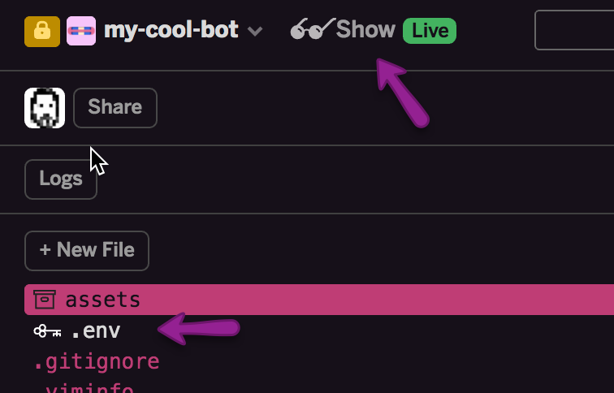

# Deploying Botkit to Glitch!

This is a complete copy of the Botkit code and a set of sample "skills" -- everything you need to get your bot online and working!
This process takes a few seconds, as Glitch downloads all the code and sets it up for you.

Check the upper left corner of your screen. When the `spinning indicator` becomes a `Show live` button, your deploy has completed.

Click the `Show live` button to open your new app in a new window, and then finally navigate back to your Botkit Studio tab to complete setting up your bot!

(You can also click the `Logs` button to watch the progress as Glitch does its magic)

### Not Using Botkit Studio?
If you did not create this project from your Studio account, adding Studio features to your bot is as easy as [creating a bot](https://botkit.groovehq.com/knowledge_base/topics/create-your-bot) in your Studio account, and adding the Studio token to your [.env file](?path=.env:1:0)

[Botkit Studio](https://studio.botkit.ai/signup?code=ciscoglitch) is a set of tools that adds capabilities to the open source Botkit library by offering hosted GUI interfaces for script management and action trigger definition.

While Botkit Studio is *not required* to build a bot using Botkit, we highly recommend it as your bot will be easier to manage, customize and extend.

### Having trouble?
* You should check [that your .env file](?path=.env:1:0) has all the correct tokens as created in your [provisioning step](https://github.com/howdyai/botkit/blob/master/docs/provisioning/).

* The [Botkit Studio knowledge base](https://botkit.groovehq.com/) contains in-depth information about using Botkit Studio, or you can [contact us](https://botkit.groovehq.com/knowledge_base/topics/contact-us-23) directly.

* *Raise your hand!* - Glitch allows users to ask the community for help directly from the editor! For more information on raising your hand, [read this blog post.](https://medium.com/glitch/just-raise-your-hand-how-glitch-helps-aa6564cb1685)

* Join our thriving community of Botkit developers and bot enthusiasts at large. Over 4500 members strong, [our open teams group](http://community.botkit.ai) is _the place_ for people interested in the art and science of making bots.

### Related Links
* [Botkit Studio](https://www.botkit.ai/)
* [Botkit Studio Documentation](https://botkit.groovehq.com/)
* [Using Botkit Studio on Glitch](https://botkit.groovehq.com/knowledge_base/topics/hosting-your-bot-on-glitch)
